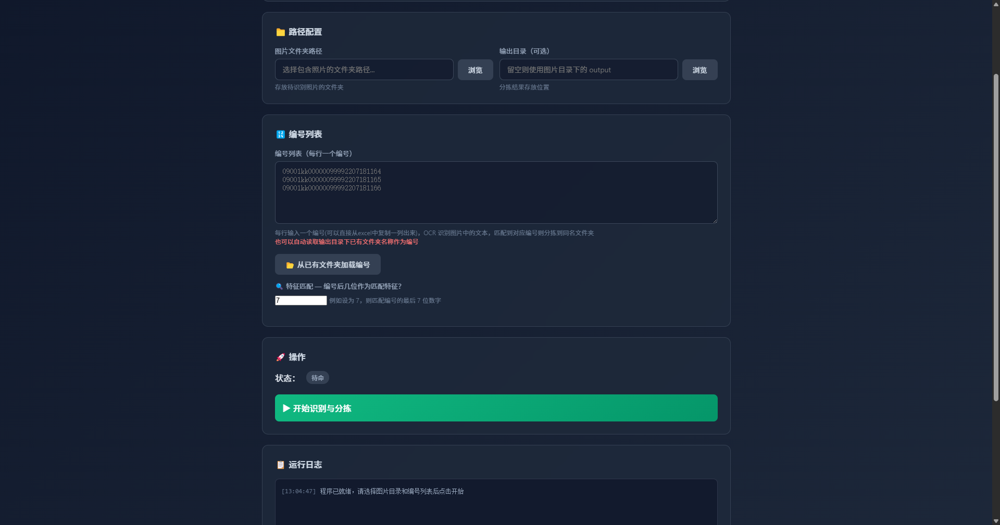

# Meter OCR App — 图片 OCR 识别与自动分拣工具

基于 **Tauri v2 + Rust + ocrs/rten** 的跨平台离线桌面客户端。
选择照片文件夹和输入编号列表，程序自动识别图片中的文本，
匹配到对应编号后分拣到同名文件夹，未匹配的移入「模糊图片」。

## 界面预览



## 功能特性

- **离线 OCR**：使用 PP-OCR 模型（ocrs + rten），纯 Rust 运行，无需网络
- **自动分拣**：识别图片文本后，按编号尾部特征自动分类
- **编号后 N 位匹配**：可配置匹配位数（默认后 7 位）
- **实时进度**：处理进度、匹配统计、运行日志实时展示
- **跨平台**：Windows + macOS (ARM64/x64)

## 技术栈

| 组件 | 技术 |
|------|------|
| 桌面框架 | Tauri v2 |
| 后端语言 | Rust 1.96 |
| OCR 引擎 | ocrs + rten (PP-OCR) |
| 图像处理 | image |
| 前端 | HTML + CSS + Vanilla JS |
| 构建工具 | Vite 6 |

## 项目结构

```
meter-ocr-app/
├── index.html                 # 前端界面
├── package.json               # Node.js 配置
├── vite.config.js             # Vite 构建配置
├── .rapidocr_onnxruntime/
│   └── models/
│       ├── text-detection.rten   # 文本检测模型 (2.4MB)
│       └── text-recognition.rten # 文本识别模型 (9.3MB)
├── assets/qrcode/             # 收款码（可替换）
├── src-tauri/
│   ├── Cargo.toml             # Rust 依赖
│   ├── tauri.conf.json        # Tauri 配置
│   ├── capabilities/
│   │   └── default.json       # 权限配置
│   ├── icons/                 # 应用图标
│   └── src/
│       ├── main.rs            # 程序入口
│       └── lib.rs             # 核心逻辑：OCR + 分拣
└── .github/workflows/
    └── build.yml              # CI 自动编译
```

## 快速开始

### 前置要求

- [Rust](https://www.rust-lang.org/) 1.77+
- [Node.js](https://nodejs.org/) 18+
- [Tauri CLI v2](https://v2.tauri.app/) 2.x
- Windows: [MSVC Build Tools](https://visualstudio.microsoft.com/visual-cpp-build-tools/)

### 安装 & 运行

```bash
# 安装前端依赖
npm install

# 开发模式
cargo-tauri dev

# 构建发布版
cargo-tauri build

# Windows PowerShell 需要手动添加 cargo 到 PATH
$env:PATH = "$env:USERPROFILE\.cargo\bin;$env:PATH"; cargo-tauri build
```

### 模型获取

首次运行前需要下载 OCR 模型（仅需一次）：

```bash
cargo install ocrs-cli --locked
ocrs test.png           # 自动下载模型到 ~/.cache/ocrs/
cp ~/.cache/ocrs/*.rten .rapidocr_onnxruntime/models/
```

## 使用指南

1. 启动程序，点击「浏览」选择照片文件夹
2. 输入编号列表（每行一个编号）
3. 设置「特征位数」— 编号后几位作为匹配特征（默认 7）
4. 点击「开始识别与分拣」
5. 匹配到的图片复制到对应编号文件夹，未匹配的进入「模糊或没对应编码图片」

## GitHub Actions

推送 tag 自动编译各平台安装包：

```bash
git tag v0.1.0
git push origin v0.1.0
```

产物 | 平台
---|---
`.msi` / `.exe` | Windows x64
`.dmg` | macOS ARM64 (Apple Silicon)
`.dmg` | macOS x64 (Intel)

! Mac首次打开时会提示“无法验证开发者/已损坏”。系统设置 -> 隐私与安全性 中点击 “仍要打开”。

## 打赏

如果这个工具对你有帮助，欢迎扫码支持：

| 微信支付 | 支付宝 |
|---|---|
|  |  |

## License

MIT
